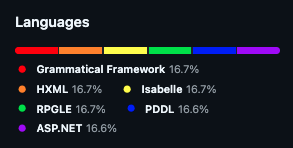

# Vexillolinguist

Takes a flag and generates a Git repo with a matching language bar.

## Example

```sh
vexillolinguist -o <path to new repo> red orange yellow green blue violet
```

would generate a repo of the form

```
.
├── .git
├── .gitattributes
├── 0000.gf
├── 0001.hxml
├── 0002.thy
├── 0003.rpgle
├── 0004.pddl
└── 0005.asax

2 directories, 7 files
```

which looks like this when pushed to GitHub:


